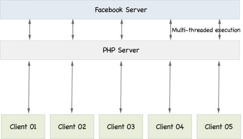
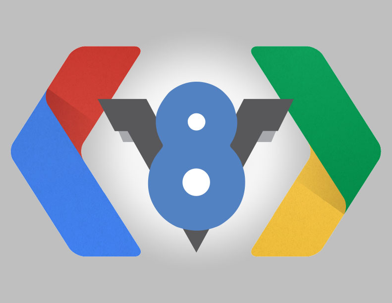
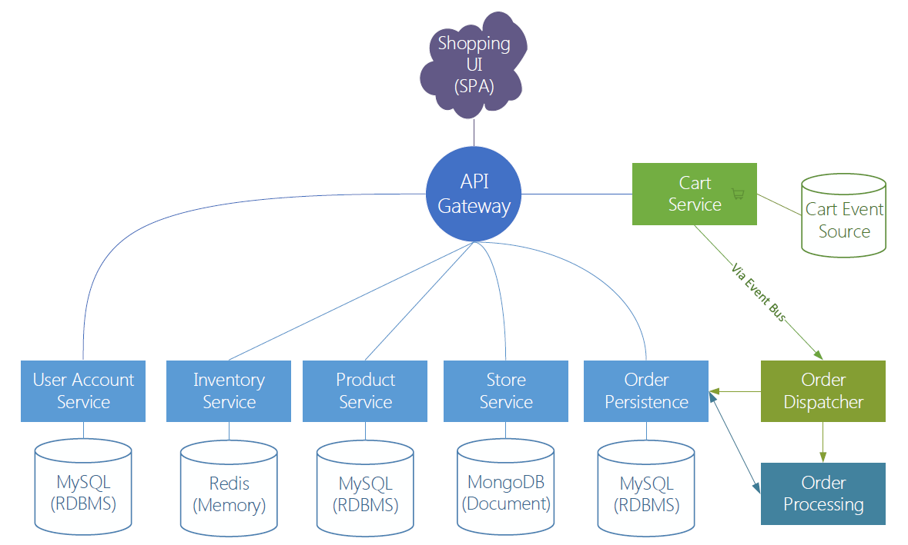
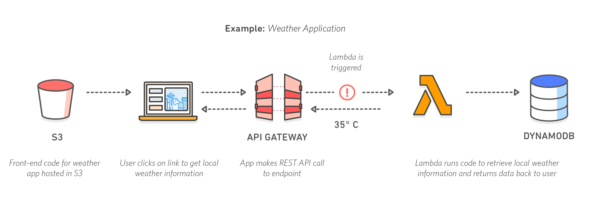

# ~~Modern~~ Actual Web Development

---

## About Me

Francesco Guardiani

Vert.x Mantainer & IT Engineering Student at Politecnico di Milano

Java Developer and Javascript Fan

*  @slinkyguardiani</div>
*  @slinkydeveloper</div>
*  slinkydeveloper.github.io</div>

---

## What web was


Note:
Prima di iniziare a parlare del web di oggi, abbiamo bisogno di una introduzione storica all'argomento. Conoscere la storia del web ci aiuterà a comprendere gli strumenti di oggi.

Voglio presentarvi l'evoluzione del web da un punto di vista tecnologico e metodologico.

---

## 1991: RPC with CORBA


Note:
Prima del 1991 i calcolatori comunicavano tra di loro senza un protocollo applicativo, ma adottando convenzioni all'interno del team di sviluppatori, di come usare i socket TCP. CORBA risolveva questo problema: è un protocollo applicativo unico, indipendente dal linguaggio di programmazione, che mette in contatto server e client. CORBA implementa il paradigma RPC (Remote Procedure Call), cioè il client chiama una funzione che viene eseguita sul server in maniera totalmente trasparente.

---

## 1991: Web Server and HTML Markup language


Note:
Tutto è iniziato così. Il fulcro del web erano 4 tecnologie:
- Un web server
- Un web client
- Il protocollo applicativo HTTP
- Il linguaggio di markup HTML

Le pagine erano esclusivamente statiche

---

## For more info

http://info.cern.ch

---

## 1993: CGI


Note:
La storia del web dinamico è iniziata con CGI. CGI è un protocollo standard che permetteva ai web server di eseguire software di qualsiasi linguaggio per generare/elaborare pagine dinamicamente. Tutt'oggi è ancora usato in alcuni usecase particolari come i pannelli di controllo dei router.

Cit. Wikipedia: Il file CGI è un semplice programma già compilato e la risposta viene acquisita attraverso standard output (banalmente cout).

---

## Web and Network Application were different!

Note:
Nonostante il web iniziava ad essere dinamico, si faceva distinzione netta tra applicazione di rete e web. Mentre oggi da pagine web (quindi da HTTP) accediamo a tantissimi servizi, prima per ognuno di questi servizi avevamo una applicazione binaria dedicata (che usavano CORBA o simili).

Questa distizione è stata fatta per moltissimi anni

---

## 1993: The browser war begins


Note:
Il primo web browser grafico fu Mosaic, poi conosciuto come Netscape. La guerra dei browser, per quanto possa sembrare una semplice guerra tra aziende e fan, è stata ed è ancora uno dei motori dell'innovazione nel web.

---

## 1995: PHP


Note:
PHP è stato il primo tentativo di semplificare lo sviluppo del web. Tentativo riuscito alla grande, in quanto si deve a PHP la diffusione del web dinamico. Il PHP genera pagine web in base ai parametri della richiesta: Header HTTP, risultati di un form HTML o sessione HTTP.

---

## PHP introduced three paradigms

- Multi-Threaded Execution of requests
- SSR: Server Side Rendering
- Stateful connections

Note:
PHP ha introdotto/rielaborato questi tre paradigmi fondamentali

---

## Multi-Threaded Execution of requests



Note:
Il PHP spawna un nuovo thread/processo ogni volta che un nuovo client si collega al server. Questo processo rimane attivo finchè non viene completata la richiesta, poi il processo muore. Se si collegano 5 client contemporaneamente si creano 5 thread che vengono eseguiti parallelamente

---

## SSR: Server Side Rendering

Note:
Le pagine vengono renderizzate sul server, di conseguenza per ogni minimo cambiamento è necessario effettuare di nuovo la richiesta al server

---

## Stateful connections


Note:
Per conservare informazioni riguardo la connessione, come ad esempio l'utente loggato, si utilizza il meccanismo delle sessioni HTTP, conosciuto anche con il nome di Cookie

---

## 1995: Javascript


Note:
Uno dei primi risultati della guerra dei browser fu Javascript (formalmente ECMAScript). Questo linguaggio, ideato come killer feature di Netscape, viene eseguito sul browser (cioè lato client) ed è inizialmente usato per validare i form HTML, come ad esempio controllare che un dato inserito fosse una email o una data valida.

---

## 1997: XML Born

```xml
<?xml version="1.0" encoding="UTF-8"?>
<note>
  <to>Tove</to>
  <from>Jani</from>
  <heading>Reminder</heading>
  <body>Don't forget me this weekend!</body>
</note>
```

Note:
XML può essere visto come l'HTML delle informazioni. Il suo scopo è quello di trasportare esclusivamente informazioni, chiamate metadata, che poi vengono elaborate e mostrate all'utente da un client.

---

## 1997-1998: Java 1.1 & Java 1.2


Note:
Durante l'esplosione del web, tra cui la nascita di Amazon e del web server Apache, nel mondo delle network application si impone Java:
- è semplice da utilizzare
- utilizza il moderno OOP
- fornisce API pronte per sviluppare interfacce grafiche
- fornisce API pronte per collegare in modo trasparente server e client (RMI)

---

## 1997-2000: Microsoft Outlook Web App and AJAX


Note:
Microsoft, per offrire servizi innovativi ai propri clienti, sviluppa un servizio che permette di accedere alla casella di posta dal web browser Internet Explorer. Questa è tra le prime vere web applications. Sottolineare cos'è AJAX sul grafico

---

## AJAX consequences

- AJAX makes user experience more responsive
- AJAX reduces the work of servers
- Web applications now are made by a frontend application and a backend application

Note:
AJAX ha delle conseguenze importantissime nel mondo dello sviluppo web
- Rende l'esperienza utente molto più responsiva: l'utente non ricarica la pagina ogni volta che ha bisogno di nuove informazioni
- Riduce il carico di lavoro sui server, che ora generano solo XML e non le pagine complete
- Ora le applicazioni web sono composte da due componenti principali: il frontend, cioè l'insieme di HTML e script Javascript, e il backend, cioè il software che si occupa di generare XML da fornire ai client in base alle richieste eseguite

---

## Web applications now have a similar structure to network applications

---

## 1998-1999: XML-RPC & SOAP


Note:
SOAP è l'ultimo grande standard delle network applications. Utilizza HTTP per il trasporto e XML come markup per le informazioni. Queste tecnologie ne rende plausibile il suo utilizzo anche per le web application. SOAP è comunque ancora oggi (spesso insieme ad altri protocolli) lo standard de facto per le network applications

---

## 2000: RESTful architecture

- No state on server
- Client knows less things about the server
- Unique interface
- Cacheability

Note:
RESTful è un'architettura che si contrappone a SOAP ma con ragionamenti simili. Queste sono le maggiori differenze.
Non può essere comparato direttamente con SOAP in quanto REST è un paradigma di programmazione e SOAP un protocollo specifico, ma possiamo interpretare questo confronto così:
SOAP è molto più incentrato sulle network applications piuttosto che in un utilizzo con AJAX

---

## REST and HTTP

<style type="text/css">
.tg  {border-collapse:collapse;border-spacing:0;border-color:#ccc;}
.tg td{font-family:Arial, sans-serif;font-size:14px;padding:10px 5px;border-style:solid;border-width:1px;overflow:hidden;word-break:normal;border-color:#ccc;color:#333;background-color:#fff;}
.tg th{font-family:Arial, sans-serif;font-size:14px;font-weight:normal;padding:10px 5px;border-style:solid;border-width:1px;overflow:hidden;word-break:normal;border-color:#ccc;color:#333;background-color:#f0f0f0;}
.tg .tg-yw4l{vertical-align:top;border-bottom: 1px solid #ccc !important;}
@media screen and (max-width: 767px) {.tg {width: auto !important;}.tg col {width: auto !important;}.tg-wrap {overflow-x: auto;-webkit-overflow-scrolling: touch;}}</style>
<div class="tg-wrap"><table class="tg">
  <tr>
    <th class="tg-yw4l">Operation</th>
    <th class="tg-031e">URI</th>
    <th class="tg-031e">HTTP Method</th>
    <th class="tg-yw4l">Query Parameters</th>
    <th class="tg-yw4l">Path Parameters</th>
    <th class="tg-yw4l">Request Body</th>
    <th class="tg-yw4l">Response body</th>
    <th class="tg-yw4l">Note</th>
  </tr>
  <tr>
    <td class="tg-yw4l">Get user</td>
    <td class="tg-yw4l">/users/{user_id}</td>
    <td class="tg-yw4l">GET</td>
    <td class="tg-yw4l"></td>
    <td class="tg-yw4l">user_id: User id</td>
    <td class="tg-yw4l"></td>
    <td class="tg-yw4l">`User` object</td>
    <td class="tg-yw4l">Logged user receives<br>`ExtendedUser` object<br>like /users/me</td>
  </tr>
  <tr>
    <td class="tg-yw4l">Add user</td>
    <td class="tg-yw4l">/users/add_user</td>
    <td class="tg-yw4l">POST</td>
    <td class="tg-yw4l"></td>
    <td class="tg-yw4l"></td>
    <td class="tg-yw4l">`User` object</td>
    <td class="tg-yw4l">`id` string of new user</td>
    <td class="tg-yw4l"></td>
  </tr>
  <tr>
    <td class="tg-yw4l">List users</td>
    <td class="tg-yw4l">/users</td>
    <td class="tg-yw4l">GET</td>
    <td class="tg-yw4l">filter: users filter</td>
    <td class="tg-yw4l"></td>
    <td class="tg-yw4l"></td>
    <td class="tg-yw4l">List of `User` objects</td>
    <td class="tg-yw4l"></td>
  </tr>
  <tr>
    <td class="tg-yw4l">Get logged user</td>
    <td class="tg-yw4l">/users/me</td>
    <td class="tg-yw4l">GET</td>
    <td class="tg-yw4l"></td>
    <td class="tg-yw4l"></td>
    <td class="tg-yw4l"></td>
    <td class="tg-yw4l">`ExtendedUser` object</td>
    <td class="tg-yw4l"></td>
  </tr>
  <tr>
    <td class="tg-yw4l">Update user</td>
    <td class="tg-yw4l">/users/me</td>
    <td class="tg-yw4l">PUT</td>
    <td class="tg-yw4l"></td>
    <td class="tg-yw4l"></td>
    <td class="tg-yw4l">`User` object</td>
    <td class="tg-yw4l">`ExtendedUser` object</td>
    <td class="tg-yw4l">A user can modify only<br>itself</td>
  </tr>
  <tr>
    <td class="tg-yw4l">Remove user</td>
    <td class="tg-yw4l">/users/{user_id}</td>
    <td class="tg-yw4l">DELETE</td>
    <td class="tg-yw4l"></td>
    <td class="tg-yw4l">user_id: User id</td>
    <td class="tg-yw4l"></td>
    <td class="tg-yw4l">`ok` string</td>
    <td class="tg-yw4l">Only users of `admin`<br>group can remove users</td>
  </tr>
</table></div>

---

## The new Millenium: Web services


Note:
Siamo finalmente nel nuovo millennio!

SOAP e REST danno il via all'esplosione dei web services, o web API. Ora non sono solo i calcolatori interconnessi tra di loro, ma anche gli applicativi web formano una tela di interconnessioni elaboratissima. I web service sono servizi pagati dagli utilizzatori per ottenere informazioni in formato XML che poi vengono rielaborate per essere utilizzate nei propri applicativi. AJAX e SOAP permettono di usufruire di questi servizi sia da web client che da web server.

---

### SOAP/REST Web Application infrastructure


Note:
- web server pool
- load balancer
- event queue/bus
- monolita: applicativo backend completo di tutti i componenti software per completare una richiesta
- api gateway
- manca una base di dati
- interconnessione con mainframe legacy e servizi web esterni
- possibilità di utilizzare una web app o applicazione binaria

In questo nuovo mondo si affermano:
- La programmazione asincrona
- La programmazione SOA

---

## Synchronous model is no more suitable


Note:
In questo mondo il modello sincrono non è più adatto per sviluppare applicativi web responsivi

---

## Asynchronous is better


Note:
Far notare che programmazione sincrona e asincrona sono paradigmi di programmazione che prescindono dal single threading e multithreading o in generale da come sono implementati

---

## Service Oriented Architecture and Loose Coupling

Note:
Il termine SOA descrive a pieno come deve essere una web app: deve essere un interconnessione di servizi interni al monolita ed esterni tra di loro indipendenti il più possibile (loose coupled). è il classico concetto di programmazione modulare degli anni 70 portato però nel mondo del web. Questo porta enormi vantaggi, il primo di tutti è la miglior ottimizzazione del lavoro di squadra.
Questa cultura è stata favorita enormemente dallo sviluppo di architetture REST, loose coupled per definizione rispetto al tradizionale SOAP

---

## No more differences between network and web applications!


---

### 2004-2005: Google and Web applications

 

Note:
Le web application avevano un problema fondamentale all'inizio del nuovo millenio: erano molto lente per via degli antiquati JS engines e la loro architettura complessa, confrontanta con quella del PHP, allontanava nuovi sviluppatori. Le alternative a questo tipo di architettura erano due: PHP o Flash/Java Applet
Prove più evidenti del dominio PHP: Wordpress (2003) e Facebook (2004).
D'altro canto molte aziende, Google tra le prime, vede le potenzialità di questa architettura, in particolare per le possibilità di interazione con l'utente che questo tipo di architettura favorisce e la semplicità di scalabilità, un vero incubo nelle architetture PHP.

---

## 2005: Yahoo starts using JSON


Note:
Il primo tentativo per velocizzare l'architettura delle web apps è stato cambiare il protocollo con cui si formattavano i dati.

Spiega JSON. JSON esiste da quando esiste Javascript, ma viene iniziato ad usare significativamente dopo che Yahoo (il più grande provider di API Web di allora) lo adotta per i propri web services

JSON è più veloce di XML perchè ha una sintassi più leggera e sopratutto perchè è supportato nativamente all'interno della sintassi JS

---

### XML

```xml
<employees>
    <employee>
        <firstName>John</firstName> <lastName>Doe</lastName>
    </employee>
    <employee>
        <firstName>Anna</firstName> <lastName>Smith</lastName>
    </employee>
    <employee>
        <firstName>Peter</firstName> <lastName>Jones</lastName>
    </employee>
</employees>
```

### JSON

```json
{"employees":[
    { "firstName":"John", "lastName":"Doe" },
    { "firstName":"Anna", "lastName":"Smith" },
    { "firstName":"Peter", "lastName":"Jones" }
]}
```

---

## 2006: JQuery


Note:
Una spinta importante alle web apps è stata data da jQuery, la libreria più importante mai esistita per Javascript. Se comprate un libro di programmazione su Javascript, c'è almeno un capitolo su jQuery. jQuery semplifica molte operazioni che altrimenti con il Javascript Vanilla (senza librerie) sarebbero molto complesse da effettuare:
- ricerca, aggiunta e modifica di HTML
- esecuzione di richieste AJAX
- esecuzione di codice in risposta a determinati eventi

jQuery ha assunto una tale importanza che molte API di jQuery sono state portate nello standard del Javascript

---

### 2008: Google's V8 Javascript engine

</img>

Note:
V8 è l'engine utilizzato da Google Chrome. Quando è uscito è stata una assoluta rivoluzione per il mondo del web, in quanto la sua concezione diversa dagli altri JS engine sul mercato portava prestazioni comparabili a quelle del C++.

Tutt'oggi un software C++ è veloce 1.5 volte rispetto allo stesso software scritto in JS e eseguito su V8

---

## 2009: Node.JS aka V8 for backend


Note:
V8 non ha solo favorito l'impiego di JS nel frontend, ma ha favorito l'impiego del JS, linguaggio ormai maturo e con una enorme community alle spalle, nel mondo backend.
Sviluppare una backend con Node.JS, incastrato in una architettura REST, è così semplice che ha pian piano eliminato tutte le altre architetture pre esistenti (in primis PHP).
Il modello di programmazione di Node.JS è stato così largamente accettato che è stato implementato in vari modi su altri linguaggi già esistenti

---

## 2010's-Now: Mobile market destroys last PHP and SOAP chances


Note:
Il mercato mobile solidifica il mercato delle Web API RESTful. Tutt'oggi esistono applicativi PHP e SOAP, ma pian piano si stanno migrando questi ultimi in favore di architetture RESTful.

---

## 2010-Now: Single Page Applications from Angular.JS...


Note:
Angular apre la via a una semplificazione maggiore dello sviluppo frontend delle applicazioni web. Angular permette lo sviluppo di SPA, applicazioni dove la pagina viene caricata una sola volta. A seconda delle interazioni dell'utente le pagine successive vengono costruite dinamicamente, chiedendo ulteriori componenti HTML al web server o metadata al backend, senza ricaricare tutta la web app da capo.

---

## 2013-Now: ...to React


---

## Now: Microservices...



Note:
I microservice sono lo step evolutivo più recente dello sviluppo web backend. Lo sponsor principale di questa filosofia è stato Netflix che, oltre ad aver coniato il termine, ha sviluppato moltissimi tool per le architetture microservices.

Il concetto dietro i microservice è quello di smontare il monolita in tanti piccoli componenti, che si interconnettono tra di loro.

è il concetto di SOA sotto steroidi!

---

## Future: ...and Serverless



---

### So how it looks like a modern web app?


---

### So what I need to know today?

- Javascript, both client and server side
- JSON
- RESTful, microservices and serverless architecture
- Java
- At least React or Angular or Vue
- Containers with Docker and Kubernetes
- Serverless with OpenWhisk and AWS Lambda

---

## Thank You!

---

<video>
  <source data-src="img/wat.mp4" type="video/mp4" />
</video>